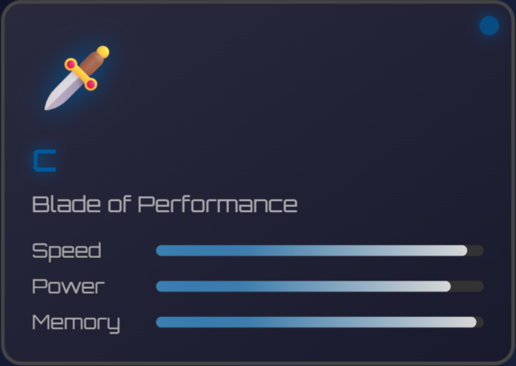
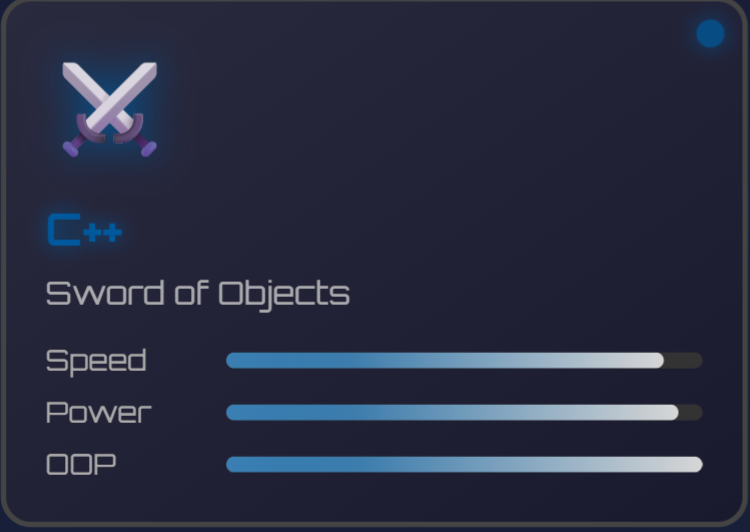
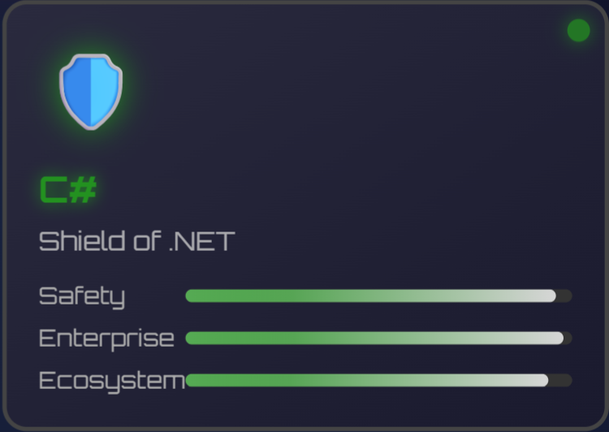
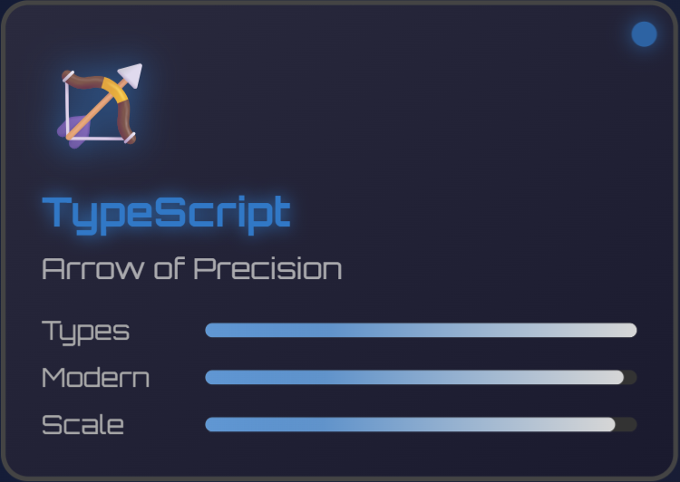
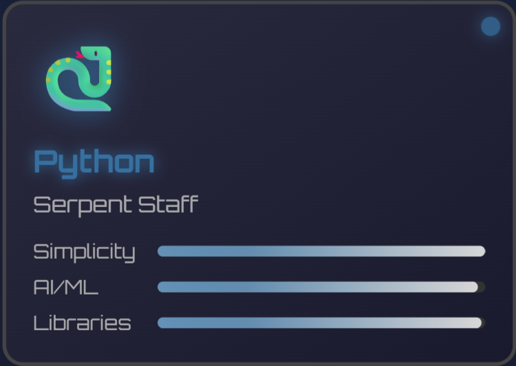
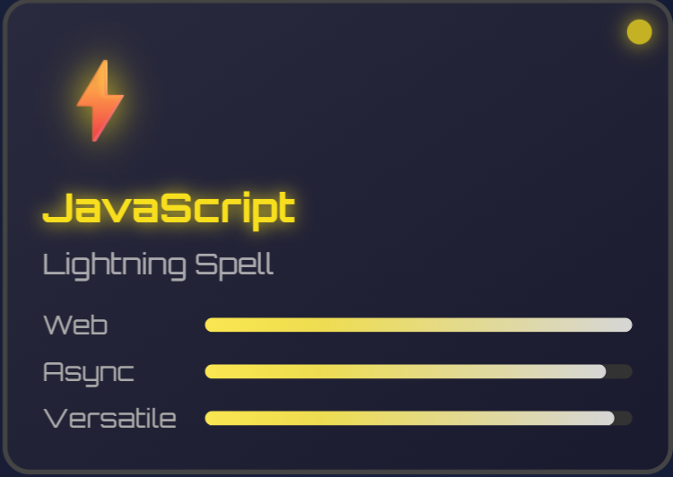
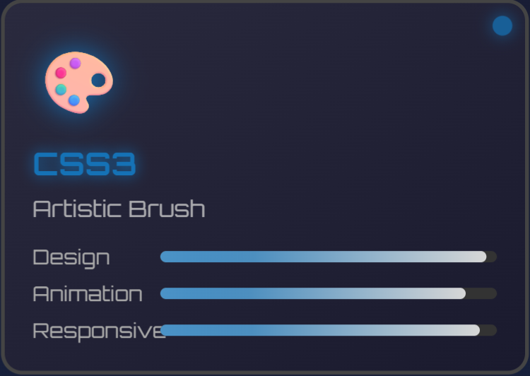
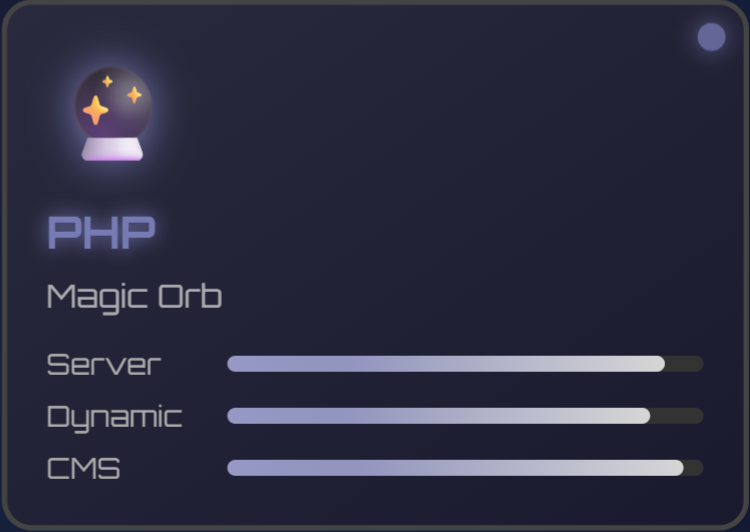
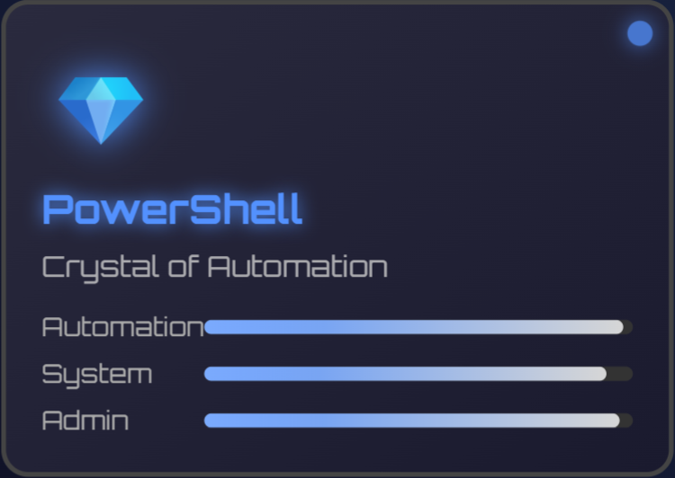

# 🎮 Welcome to Andrew's Code Quest!

## 💻 **DEVELOPER ANDREW** 💻

### 🎮 _Full-Stack Doge_ • Level ∞

### 🎯 **Current Quest**

🧠 Mastering AI & Machine Learning • 🏹 TypeScript Precision Training

### 🤝 **Party Status**

🌟 Seeking AI/Web Dev Adventurers for Epic Code Battles!

### 📚 **Training Modules**

⚡ TensorFlow • 🔥 PyTorch • 💎 TypeScript Mastery

### ❓ **Ask me about**

🐛 Debugging Mysteries • 🚀 Legendary Programming Techniques • 🎯 Code Battles • 🎮 Game Development

### 🐕 **Doge Status**

_Such code. Much skill. Very full-stack. WOW! 🎉_

## 🌐 Guild Communications:

---

## ⚔️ Weapon Arsenal (Programming Languages):

|                                                                                                         |                                                                                                                             |
| :-----------------------------------------------------------------------------------------------------: | :-------------------------------------------------------------------------------------------------------------------------: |
|     🗡️ **C - Blade of Performance**        |              ⚔️ **C++ - Sword of Objects**                 |
|      🛡️ **C# - Shield of .NET**          |  🏹 **TypeScript - Arrow of Precision**      |
| 🐍 **Python - Serpent Staff**    |    ⚡ **JavaScript - Lightning Spell**       |
| 🏗️ **HTML5 - Structure Hammer**     |              🎨 **CSS3 - Artistic Brush**                 |
|       🔮 **PHP - Magic Orb**           | 💎 **PowerShell - Crystal of Automation**    |

---

## 🛠️ Skill Tree (Technologies & Tools):

### 🏰 Infrastructure & Systems

🐧 

☁️ 

🌐 

⚡ 

### ⚒️ Development Frameworks

🏛️ 

🎮 

🎯 

### 🗄️ Data Vaults

🐬 

💎 

### 📊 Analytics & Intelligence

🔬 

📈 

🔢 

🐼 

### 🌐 Network Mastery

🌐 

### 🎨 Creative Arsenal

🎨 

🖼️ 

✏️ 

🎭 

🎯 

📐 

### ⚙️ Development Tools

🌿 

🏰 

🔧 

### 🎮 Gaming Platforms

🕹️ 

🎮 

---

# 📊 Player Statistics & Experience Points:

## 💯 **Combat Performance**

 

## 🔥 **Coding Streak Combo**

 

## 🎯 **Skill Distribution**

---

## 🏆 **LEGENDARY HALL OF FAME**

### 🎖️ **ACHIEVEMENT UNLOCKED** 🎖️

**『 Coding Mastery Trophies 』**

🔥 **STREAK LEGEND** • 🌟 **MULTI-LANGUAGE WARRIOR** • ⚡ **COMMIT CHAMPION** • 🚀 **REPOSITORY MASTER**

---

## 🌟 **Special Abilities Unlocked:**

- 🔮 **Code Debugging Mastery** - Can spot bugs in milliseconds
- ⚡ **Full-Stack Lightning** - Frontend to Backend in record time
- 🧠 **AI Whisperer** - Speaks fluent Machine Learning
- 🛡️ **Problem Solver** - No challenge too complex
- 🌐 **Network Navigator** - Cisco certified pathfinder
- 🏹 **TypeScript Archer** - Currently mastering precision typing
- 🎭 **Pixel Artisan** - Crafting digital art with Aseprite magic

---

## 🎯 **Mission Status: ACTIVE**

### 💫 **Progress Bar - Current Learning Journey**

**🏹 TypeScript Mastery** • **🧠 AI/ML Quest** • **⚡ Full-Stack Domination**

---

_🎮 **"Code is poetry written in logic, bugs are just plot twists!"** 🎮_

