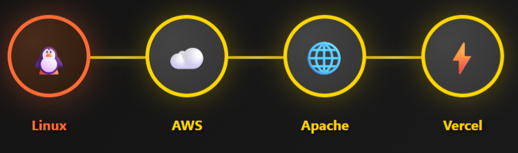
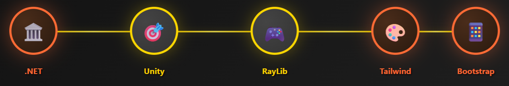
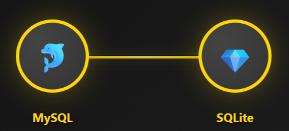
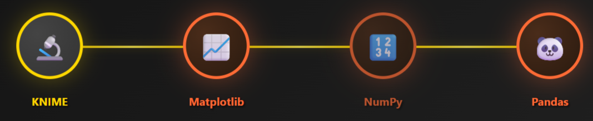
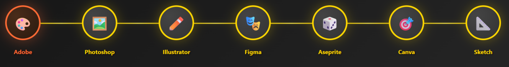
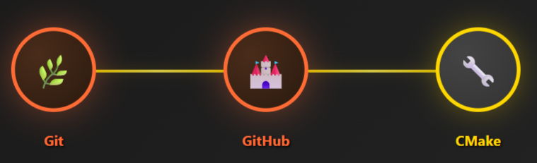

## 💻 **DEVELOPER ANDREW** 💻

### 🎮 _Full-Stack Doge_ • Level 1

### 🎯 **Current Quest**

🧠 Mastering AI & Machine Learning • 🏹 TypeScript Precision Training

### 🤝 **Party Status**

🌟 Seeking AI/Web Dev Adventurers for Epic Code Battles!

### 📚 **Training Modules**

⚡ TensorFlow • 🔥 PyTorch • 💎 TypeScript Mastery

### ❓ **Ask me about**

🐛 Debugging Mysteries • 🚀 Legendary Programming Techniques • 🎯 Code Battles • 🎮 Game Development

### 🐕 **Doge Status**

_Such code. Much skill. Very full-stack. WOW! 🎉_

## 🌐 Guild Communications:

---

## ⚔️ Weapon Arsenal (Programming Languages):

  <table style="width: 100%; min-width: 300px;">
    <tr>
      <td align="center">
         
        <b>🗡️ C</b> 
        <i>Blade of Performance</i>
      </td>
      <td align="center">
         
        <b>⚔️ C++</b> 
        <i>Sword of Objects</i>
      </td>
      <td align="center">
         
        <b>🛡️ C#</b> 
        <i>Shield of .NET</i>
      </td>
    </tr>
    <tr>
      <td align="center">
         
        <b>🏹 TypeScript</b> 
        <i>Arrow of Precision</i>
      </td>
      <td align="center">
         
        <b>🐍 Python</b> 
        <i>Serpent Staff</i>
      </td>
      <td align="center">
         
        <b>⚡ JavaScript</b> 
        <i>Lightning Spell</i>
      </td>
    </tr>
    <tr>
      <td align="center">
         
        <b>🏗️ HTML5</b> 
        <i>Structure Hammer</i>
      </td>
      <td align="center">
         
        <b>🎨 CSS3</b> 
        <i>Artistic Brush</i>
      </td>
      <td align="center">
         
        <b>🔮 PHP</b> 
        <i>Magic Orb</i>
      </td>
    </tr>
    <tr>
      <td align="center">
         
        <b>💎  PowerShell</b> 
        <i>Crystal of Automation</i>
      </td>
    </tr>
  </table>

---

## 🛠️ Skill Tree (Technologies & Tools):

### 🏰 Infrastructure & Systems

  

### ⚒️ Development Frameworks

  

### 🗄️ Data Vaults

  

### 📊 Analytics & Intelligence

  

### 🌐 Network Mastery

  

### 🎨 Creative Arsenal

  

### ⚙️ Development Tools

  

### 🎮 Gaming Platforms

  

---

# 📊 Player Statistics & Experience Points:

## 💯 **Combat Performance**

 

## 🔥 **Coding Streak Combo**

 

## 🎯 **Skill Distribution**

---

## 🏆 **LEGENDARY HALL OF FAME**

### 🎖️ **ACHIEVEMENT UNLOCKED** 🎖️

**『 Coding Mastery Trophies 』**

🔥 **STREAK LEGEND** • 🌟 **MULTI-LANGUAGE WARRIOR** • ⚡ **COMMIT CHAMPION** • 🚀 **REPOSITORY MASTER**

---

## 🌟 **Special Abilities Unlocked:**

- 🔮 **Code Debugging Mastery** - Can spot bugs in milliseconds
- ⚡ **Full-Stack Lightning** - Frontend to Backend in record time
- 🧠 **AI Whisperer** - Speaks fluent Machine Learning
- 🛡️ **Problem Solver** - No challenge too complex
- 🌐 **Network Navigator** - Cisco certified pathfinder
- 🏹 **TypeScript Archer** - Currently mastering precision typing
- 🎭 **Pixel Artisan** - Crafting digital art with Aseprite magic

---

## 🎯 **Mission Status: ACTIVE**

### 💫 **Progress Bar - Current Learning Journey**

**🏹 TypeScript Mastery** • **🧠 AI/ML Quest** • **⚡ Full-Stack Domination**

---

_🎮 **"Code is poetry written in logic, bugs are just plot twists!"** 🎮_

